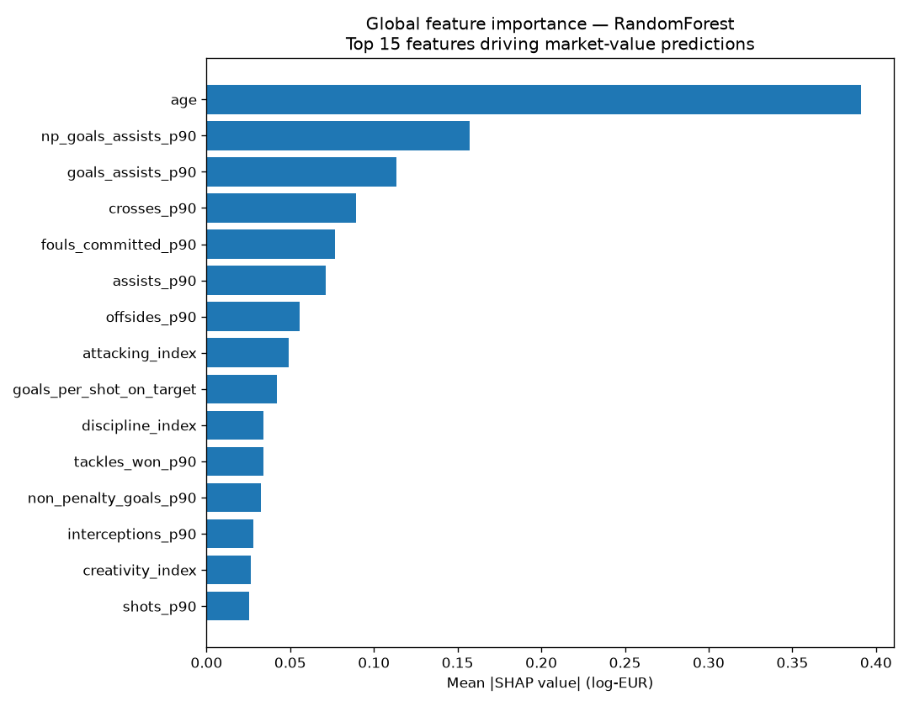
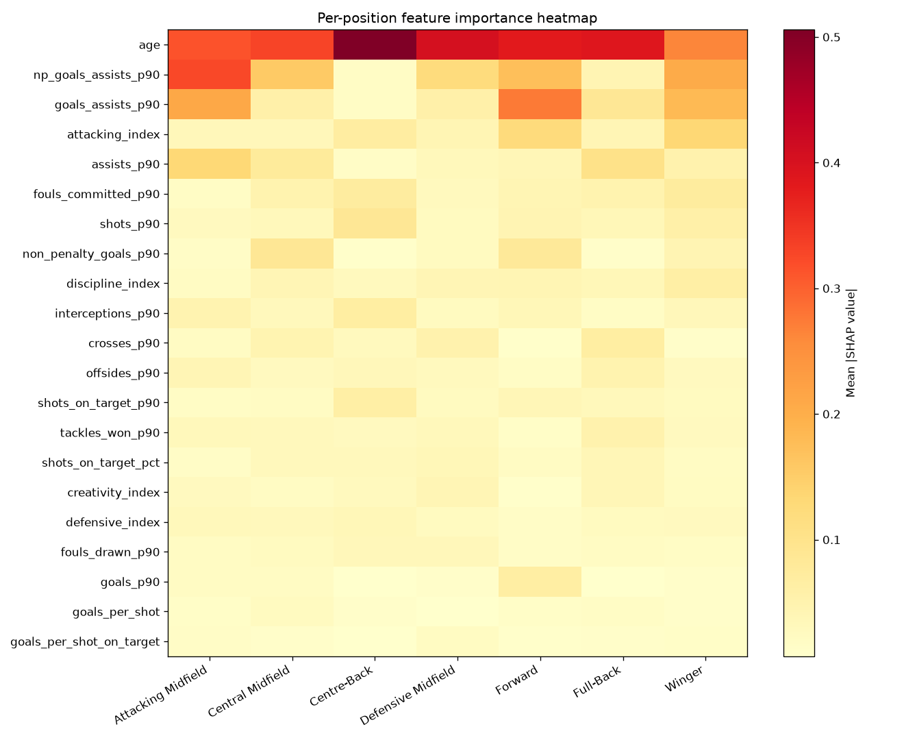

# SHAP Report — Week 9 (v2)

Global tree model explained: **RandomForest** (best overall)

_Note: SHAP was computed on the best tree-based model for each scope. Where a Linear Regression model was the overall best-R² winner (a common outcome under 5-fold CV in this study), the tree model is used as a proxy explainer since SHAP provides local-level attributions not natively available from linear coefficients._

## Global feature importance (top 15)

| Feature | Mean \|SHAP\| |
|---|---|
| age | 0.3911 |
| np_goals_assists_p90 | 0.1572 |
| goals_assists_p90 | 0.1136 |
| crosses_p90 | 0.0895 |
| fouls_committed_p90 | 0.0768 |
| assists_p90 | 0.0712 |
| offsides_p90 | 0.0556 |
| attacking_index | 0.0488 |
| goals_per_shot_on_target | 0.0421 |
| discipline_index | 0.0341 |
| tackles_won_p90 | 0.0340 |
| non_penalty_goals_p90 | 0.0326 |
| interceptions_p90 | 0.0279 |
| creativity_index | 0.0266 |
| shots_p90 | 0.0256 |

## Per-position best tree models

| Position family | Tree model used | Note |
|---|---|---|
| Attacking Midfield | RandomForest | best overall |
| Central Midfield | RandomForest | tree proxy (overall best was LinearRegression) |
| Centre-Back | RandomForest | best overall |
| Defensive Midfield | RandomForest | best overall |
| Forward | RandomForest | best overall |
| Full-Back | RandomForest | best overall |
| Winger | RandomForest | tree proxy (overall best was LinearRegression) |

## Local case studies

For each player: predicted vs actual market value + six features contributing most to the global-model prediction (↑ pushes value up, ↓ pushes down).

### Rodri — Manchester City (2023/24)

- Predicted: **€60.6m**
- Actual: **€120.0m**
- Prediction error: **€-59.4m**

Top drivers:
- ↑ `np_goals_assists_p90` (value=0.52, contribution=+0.597)
- ↑ `goals_assists_p90` (value=0.52, contribution=+0.312)
- ↑ `age` (value=27.00, contribution=+0.281)
- ↑ `defensive_index` (value=2.09, contribution=+0.132)
- ↑ `assists_p90` (value=0.28, contribution=+0.114)
- ↑ `tackles_won_p90` (value=1.32, contribution=+0.103)

### Bukayo Saka — Arsenal (2023/24)

- Predicted: **€105.2m**
- Actual: **€140.0m**
- Prediction error: **€-34.8m**

Top drivers:
- ↑ `np_goals_assists_p90` (value=0.59, contribution=+0.885)
- ↑ `age` (value=21.00, contribution=+0.505)
- ↑ `goals_assists_p90` (value=0.77, contribution=+0.494)
- ↑ `attacking_index` (value=2.42, contribution=+0.242)
- ↑ `assists_p90` (value=0.28, contribution=+0.094)
- ↑ `shots_p90` (value=3.30, contribution=+0.076)

### Erling Haaland — Manchester City (2023/24)

- Predicted: **€115.2m**
- Actual: **€180.0m**
- Prediction error: **€-64.8m**

Top drivers:
- ↑ `np_goals_assists_p90` (value=0.88, contribution=+0.910)
- ↑ `goals_assists_p90` (value=1.13, contribution=+0.560)
- ↑ `attacking_index` (value=3.26, contribution=+0.343)
- ↑ `age` (value=23.00, contribution=+0.319)
- ↑ `fouls_committed_p90` (value=0.63, contribution=+0.128)
- ↑ `shots_p90` (value=4.27, contribution=+0.124)

### Virgil van Dijk — Liverpool (2023/24)

- Predicted: **€14.3m**
- Actual: **€30.0m**
- Prediction error: **€-15.7m**

Top drivers:
- ↓ `age` (value=32.00, contribution=-0.698)
- ↑ `crosses_p90` (value=0.00, contribution=+0.258)
- ↑ `fouls_committed_p90` (value=0.65, contribution=+0.164)
- ↑ `attacking_index` (value=0.75, contribution=+0.153)
- ↑ `offsides_p90` (value=0.03, contribution=+0.111)
- ↑ `fouls_drawn_p90` (value=0.37, contribution=+0.105)

### Kevin De Bruyne — Manchester City (2023/24)

- Predicted: **€31.0m**
- Actual: **€50.0m**
- Prediction error: **€-19.0m**

Top drivers:
- ↓ `age` (value=32.00, contribution=-0.817)
- ↑ `np_goals_assists_p90` (value=1.03, contribution=+0.671)
- ↑ `goals_assists_p90` (value=1.03, contribution=+0.616)
- ↑ `attacking_index` (value=2.65, contribution=+0.285)
- ↑ `assists_p90` (value=0.74, contribution=+0.208)
- ↑ `non_penalty_goals_p90` (value=0.29, contribution=+0.089)

### Lamine Yamal — Barcelona (2024/25)

- Predicted: **€123.7m**
- Actual: **€200.0m**
- Prediction error: **€-76.3m**

Top drivers:
- ↑ `np_goals_assists_p90` (value=0.69, contribution=+0.860)
- ↑ `age` (value=17.00, contribution=+0.555)
- ↑ `goals_assists_p90` (value=0.69, contribution=+0.437)
- ↑ `attacking_index` (value=2.96, contribution=+0.272)
- ↑ `shots_p90` (value=4.54, contribution=+0.104)
- ↑ `assists_p90` (value=0.41, contribution=+0.094)
